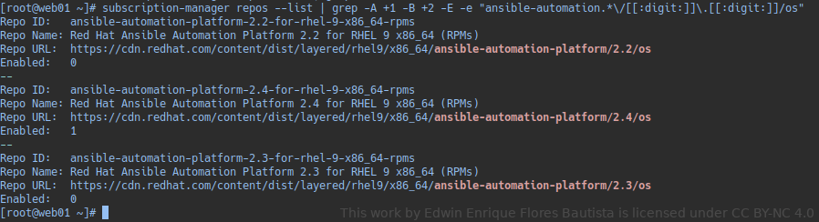
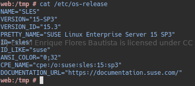
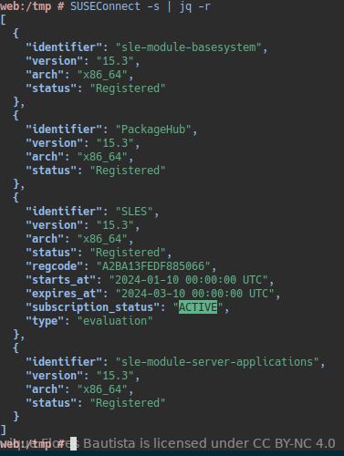
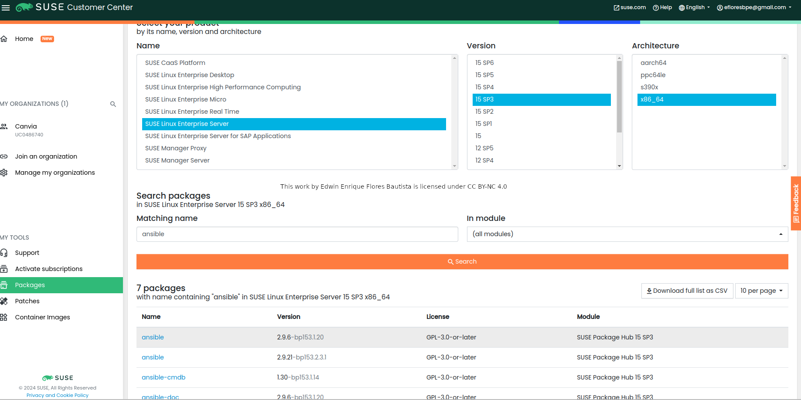
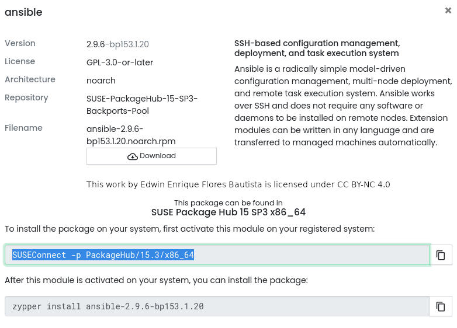

# Ansible

## Alcanse de la instalación

- [Redhat](www.redhat.com)
  - RedHat 9.3
- [SuSe](www.suse.com)
  - Sles 15.3

## Fecha de desarrollo del proyecto

10/01/2024

## Procedimiento de instalación

### RedHat

```bash
# Validar el Sistema Operativo
cat /etc/redhat-release
```

```bash
# Validar que la subcripción developer cuente con el repositorio para ansible
subscription-manager repos --list | grep -A +1 -B +2 -E -e "ansible-automation.*\/[[:digit:]]\.[[:digit:]]/os"
```



```bash
# Instalar la versión de su preferencia, en nuestro caso la disponible es la 2.4
subscription-manager repos --enable ansible-automation-platform-2.4-for-rhel-9-x86_64-rpms

# Verificar que versión de ansible esta disponible repositorios appstream y ansible
yum info ansible-core
```


```bash
# Instalar el paquete requerido en mi caso tengo 2 de los repositorios mencionados, voy a instalar el más actual
yum install ansible-core-2.15.8
# Verificar la instalación
ansible -v
```

### SuSe
```bash
# Validar el Sistema Operativo
cat /etc/os-release
```


```bash
# Validar que la subcripción de prueba este activada
SuSe
cat /etc/os-release
```



Para instalar ansible se debe ubicar el respositorio, ir a su manager suscription (scc.suse.com) y realizar la busqueda del paquete.



 Ubicado se accede al mismo para ver el procedimiento de instalación.



```bash
# Ubicado el modulo se procede a añadirlo
SUSEConnect -p PackageHub/15.3/x86_64
```
```bash
#Se refresca el repositorio
zypper refresh
```
```bash
#Se verifica que version de ansible tenemos disponible
zypper info ansible
```
```bash
#Se Procede con la instalación
zypper install ansible
```
### Procedimiento de configuración

- RedHat
- SuSe

```bash
# Realizar una copia de seguridad o backup
cp /etc/ansible/ansible.cfg{,.bkp}
```

```bash
# Añadir las opciones de configuración a tu archivo de configuración
cat > /etc/ansible/ansible.cfg<EOF
[defaults]
# configura si se debe verificar las claves de host ssh
host_key_checking = false
# usuario con el que se conectara a los demás servidores
remote_user = eflores
# llave privada que usuario el usuario remote_user para conectarse a los servidores
private_key_file = /home/eflores/.ssh/id_rsa
# archivo que contiene los hosts y grups de hosts al cual se va a conectar
inventory = /data/inventory
# Tiempo de espera para las operaciones de conexión
timeout=30
#%%%%%%%%%%%%%%%%%%%% LOGS %%%%%%%%%%%%%%%%%%%%%%
# ruta de registro de ansible, donde se registrarán la salida y eventos
log_path = /tmp/ansible_log_from_config.log

[privilege_escalation]
# Configura si el usuario deberá usar sudo para la ejecución de comandos
become = true
EOF
```

